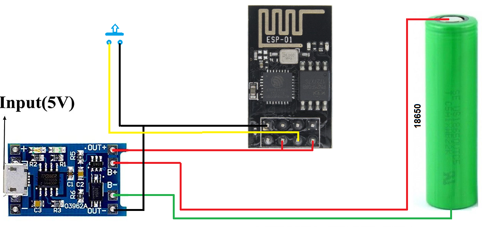

# Wifi DoorBell
I am often not inside the house and won't hear the bell when someone is at the door. 
To get notified on my cellphone I could have bought a wifi doorbeel but I had some stuff laying around that could solve the problem.
As a chat/messaging app I use Telegram, Telegram allows you to create a bot and send messages to it via an API. The steps are easy to find in the Telegram documentation

### Hardware used for the project
- ESP-01 Arduino Wifi module 
- 18650 battery cell
- USB charger BMS for the 18650 
- Push switch

### Diagram of my setup

### Installation instrucions
- Setup the WiFi SSID, password, Telegram API token and Chat ID. 
- Compile and flash

### How does it work
When the ESP-01 is powerd up it contacts the Telegram API and you will recieve a doorbeel notification.
After that the ESP is going into a deep sleep. That saves power and the battery will last much longer.
On pushing the button the ESP gets a reset and restarts, it connects to the Wifi and calls the API etc.

